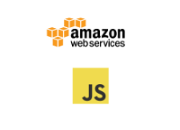
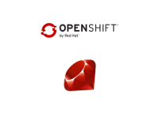
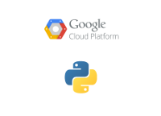
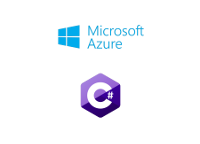
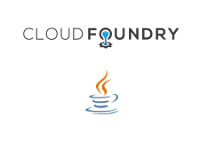

# All the clouds
This project is dashboard of microservices that deployed to 6 different cloud providers and are writen in 6 different languages. All of the microservices have continous deployment setup from a GitHub repo.

This project was built with `create-react-app` and has a Node Express backend to proxy the api calls through.

## Backend Microservices
#### (AWS/Javascript)[https://github.com/travnels/all-the-clouds-aws-serverless-js]

- Deployed on AWS Lambda
- Written in Javascript
- Serverless framework
- CD with CircleCI using the AWS CLI
- [Endpoint](https://fp55uw8uu8.execute-api.us-east-1.amazonaws.com/dev)

#### (Heroku/Clojure)[https://github.com/travnels/all-the-clouds-heroku-clojure]

- Deployed on Heroku
- Written in Clojure
- CD with Heroku
- [Endpoint](https://all-the-clouds-heroku-clojure.herokuapp.com)

#### (OpenShift/Ruby)[https://github.com/travnels/all-the-clouds-openshift-ruby]

- Deployed on OpenShift
- Written in Ruby
- CD with OpenShift
- [Endpoint](http://openshift-ruby-demo-all-the-clouds-openshift-ruby.7e14.starter-us-west-2.openshiftapps.com)

#### (Google Cloud Platform/Python)[https://github.com/travnels/all-the-clouds-gcp-python]

- Deployed on Google Cloud Platform
- Written in Python
- CD with Google Cloud Platform
- [Endpoint](http://all-the-clouds-gcp-python.appspot.com)

#### (Azure/C#)[https://github.com/travnels/all-the-clouds-azure-dotnet]

- Deployed on Azure
- Written in C#
- CD with Azure
- [Endpoint](https://all-the-clouds-azure-dotnet.azurewebsites.net/api/values/1)

#### (Cloud Foundry/Java)[https://github.com/travnels/all-the-clouds-cf-java]

- Deployed on Cloud Foundry
- Written in Java
- CD with CircleCI using the Cloud Foundry CLI
- Spring Boot Framework
- [Endpoint](https://all-the-clouds-cf-java.cfapps.io)


## Running the app locally

Install [nodemon](https://github.com/remy/nodemon) globally

```
npm i nodemon -g
```

Install server and client dependencies

```
yarn
cd client
yarn
```

To start the server and client at the same time

```
yarn dev
```

## How this works

The key to use an Express backend with a project created with `create-react-app` is on using a **proxy**. We have a *proxy* entry in `client/package.json`

``` 
"proxy": "http://localhost:5000/"
```

This tells Webpack development server to proxy our API requests to our API server, given that our Express server is running on **localhost:5000**
